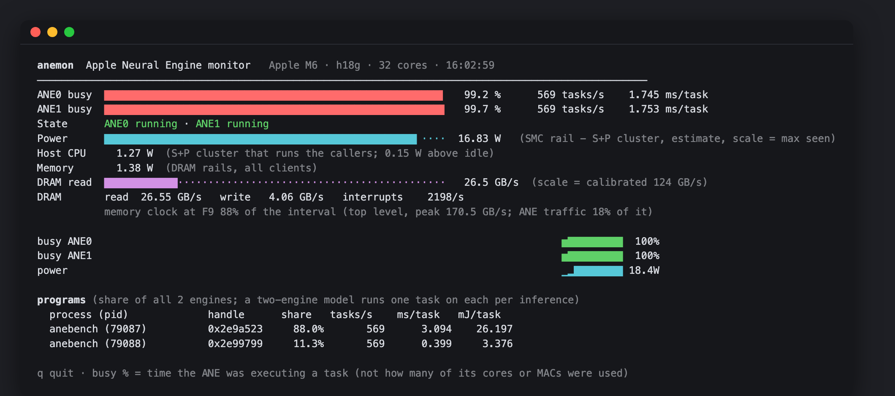

# Anemon — Apple Neural Engine monitor

A terminal monitor for the Apple Neural Engine (ANE) on Apple Silicon Macs:
how busy it is, which processes use it, how much memory traffic it makes and
how much power it draws.



## Install

```
make
sudo make install       # copies anemon and anebench to /usr/local/bin
```

Then run it from any terminal:

```
sudo anemon             # full-screen view, q to quit
anemon                  # without root: no busy %, tasks or programs
anemon --json           # one JSON object per interval
sudo anemon calibrate   # optional, about 2.5 min; M4 and M6 have built-in values
```

Options: `--interval SECONDS` (default 1), `--count N`, `--no-power`. After
pulling a new version, run `make && sudo make install` again. Without
installing, run `.build/make/anemon` from the repository.

## What the screen shows

| Line | Meaning | Root |
|---|---|---|
| `ANE busy` | Share of time each engine was executing a task; tasks/s and mean ms/task | yes |
| `State` | Each engine running or off (JSON also gives the countdown to power-off) | no |
| `Throttled` | Shown while a throttle trigger is active | no |
| `Power` | ANE power from the SMC rail PP0b minus the CPU cluster on the same rail (M4, M6) | no |
| `Host CPU` | Power of the cores that call the ANE; warns when they draw more than the ANE (many small calls) | no |
| `Memory` | M6: power of the DRAM rails, for all of memory's clients | no |
| `DRAM` | ANE read/write traffic and interrupts (JSON also gives the memory clock level) | no |
| `programs` | Per process: share of the ANE, tasks/s, ms/task and energy per task (mJ) | yes |

**busy % is time occupancy, not compute utilization**, and not speed either:
macOS lowers the ANE clock when the caller leaves gaps between requests. A
single process calling a model synchronously rarely keeps the ANE 100% busy
(about 0.3–0.4 ms of submit/complete overhead per call); longer tasks,
batching or several processes fill the gaps, as in the screenshot.

After the Mac has slept, busy % comes from driver events until the next
reboot and is less precise; reboot first on a benchmark machine.

## Supported chips

| | M4 | M5 | M6 |
|---|---|---|---|
| busy %, programs | ✓ | driver events only | ✓ (both engines) |
| DRAM | exact | lower bound above 32 GB/s | lower bound at full speed |
| power | ✓ | `powermetrics` (root) | ✓ |

Tested on macOS 27.0.1. These are private macOS interfaces and may change
between releases. On other chips, `sudo anemon calibrate` checks busy %;
DRAM and power stay empty until the chip has been characterized.

## Calibration

`sudo anemon calibrate` runs reference loads (close other ANE and GPU work
first): idle and peak power, peak INT8 throughput, read bandwidth, and a
check of busy % against known duty cycles. It sets the scale of the power and
DRAM bars; M4 and M6 have built-in values for machines without their own.

## Limitations

- While anemon runs, Instruments, `ktrace` and `fs_usage` cannot trace.
- Programs are shown by process, not by model name.
- Compute utilization is not available: the ANE's performance counters go
  only to the process that submitted the work.

Details — how each metric is read, JSON fields, validation data, and notes on
M6 and M5 — are in [`calibration/README.md`](calibration/README.md).

## License

MIT. See [LICENSE](LICENSE).
